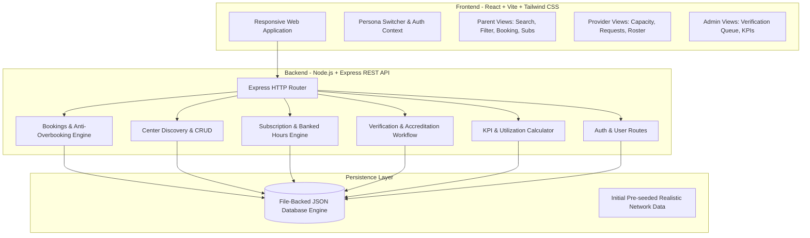
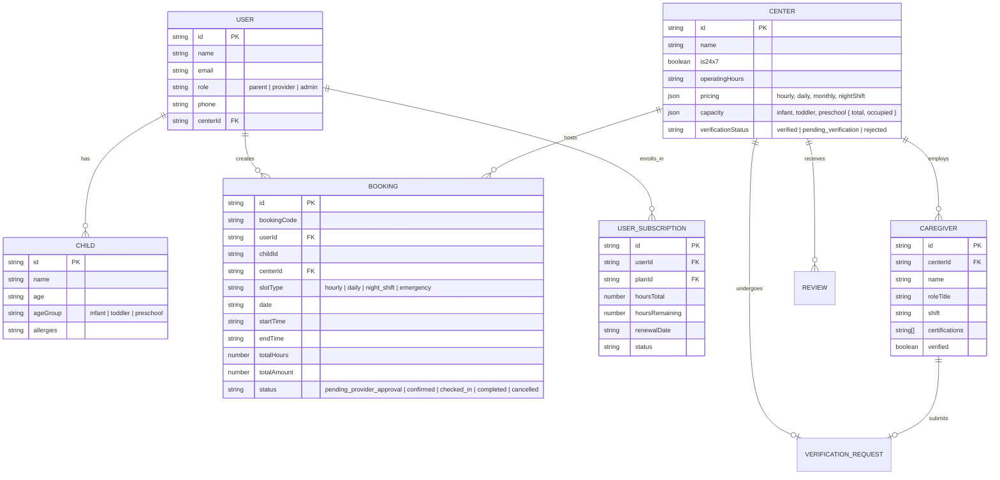

# System Architecture & Technical Specifications
## Little Steps – Trusted 24×7 Childcare Platform

**Document Version:** 1.0.0  
**Status:** Approved  
**Target Runtime:** Node.js v20+ / Modern Web Browsers  

---

## 1. High-Level Architecture Overview

Little Steps is designed as a decoupled, multi-tier web application built for high throughput, mobile-first responsiveness, and strict capacity control.



---

## 2. Component Stack

| Layer | Technology | Rationale |
| :--- | :--- | :--- |
| **Frontend Framework** | React 18 (SPA) | Component-driven UI, fast reactive state transitions between personas. |
| **Build & Bundler** | Vite 6 | Sub-second Hot Module Replacement (HMR) and optimized static production builds. |
| **Styling & Design** | Tailwind CSS 3 | Utility-first, responsive layouts, consistent color palettes and accessibility. |
| **Iconography** | Lucide React | Clean, recognizable medical, safety, and childcare icons. |
| **Backend Framework**| Express.js 4 on Node.js 22 | Lightweight REST API server with zero bloat and high request throughput. |
| **Persistence Engine**| In-memory & JSON file store | Embedded, zero-dependency persistence ideal for self-contained testing & CI/CD. |
| **Architecture** | RESTful Micro-services style | Clean route separation by domain (`centers`, `bookings`, `subscriptions`, `verification`). |

---

## 3. Data Models & Entity Relationships



---

## 4. Anti-Overbooking & Capacity Guard Algorithm

To satisfy state child welfare regulations, childcare facilities must maintain strict staff-to-child ratios (e.g. 1 caregiver to 3 infants). Overbooking is prevented via atomic capacity checks during booking creation:

```javascript
// Step 1: Extract target room from child ageGroup
const room = center.capacity[bookingData.ageGroup];

// Step 2: Validate available capacity
if (room.occupied >= room.total) {
  throw new Error(`Room capacity for ${bookingData.ageGroup} is full (${room.occupied}/${room.total}).`);
}

// Step 3: Increment occupied count
room.occupied += 1;

// Step 4: Persist state to prevent race conditions
db.save();

// Step 5: Capacity Release upon completion/cancellation
if (['rejected', 'cancelled', 'completed'].includes(newStatus)) {
  if (room.occupied > 0) room.occupied -= 1;
  db.save();
}
```

---

## 5. REST API Endpoint Specification

### 5.1 Centers & Discovery
* `GET /api/centers` – Query daycares with filters: `search`, `is24x7`, `ageGroup`, `timingType`, `maxPrice`, `status`.
* `GET /api/centers/:id` – Retrieve complete center profile including associated caregivers and reviews.
* `POST /api/centers` – Provider onboarding of a new daycare facility.
* `PUT /api/centers/:id` – Update center profile, pricing, or room capacity thresholds.

### 5.2 Caregivers
* `GET /api/caregivers?centerId=:id` – Fetch caregiver team members for a center.
* `POST /api/caregivers` – Add a new caregiver profile with certifications.
* `PUT /api/caregivers/:id` – Update caregiver shift or verification status.

### 5.3 Bookings
* `GET /api/bookings?userId=:uid&centerId=:cid&status=:st` – Fetch filtered bookings.
* `POST /api/bookings` – Create a childcare booking request (validates room capacity).
* `PATCH /api/bookings/:id/status` – Transition status (`confirmed`, `checked_in`, `completed`, `rejected`, `cancelled`).

### 5.4 Subscriptions
* `GET /api/subscriptions/plans` – Fetch available monthly plans (e.g., Night Shift Guardian).
* `GET /api/subscriptions/user/:userId` – Fetch active subscriptions and remaining hours for a parent.
* `POST /api/subscriptions/subscribe` – Enroll in a subscription package.

### 5.5 Verification & Trust
* `GET /api/verification?status=:st` – Fetch regulatory verification queue items.
* `POST /api/verification/:id/decision` – Approve or reject verification request with audit notes.

### 5.6 Analytics
* `GET /api/analytics` – Platform-wide admin KPIs (users, verified centers, utilization rate %, gross volume).
* `GET /api/analytics/center/:centerId` – Center-specific occupancy and earnings analytics.
